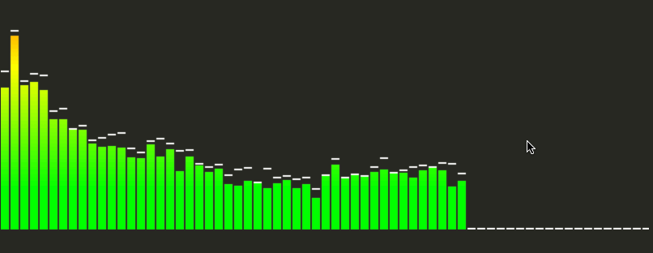

<p align="center">
  
</p>

<h1 align="center"><a href="https://soundcloud.com/nightchord">View the Nightchord Soundcloud</a></h1>

### Nightchord is a python-based music creation software capable of converting a lyric video on Youtube into a [video like this](https://www.youtube.com/watch?v=ZbNzXQX542c)

## Introduction

I started working on this project almost 2 years ago, but I just recently started getting back into it after seeing the stats on SoundCloud.

I originally used this project to learn about more advanced Python topics, and the code in this repo is extremely disorganized and confusing.

I'm working on rewriting the way you generate songs to make it a bit easier for others to use.  

This program can generate Nightcore videos by inputting one of the following paramters:

 * Youtube URL
 * Artist / Song Name
 * Locally Saved MP4/AVI
 * Locally Saved MP3

You can also pull song names from Billboard Top-X Charts for video generation.

Essentially, this programs automates the process of Downloading/Remixing/Transcribing/Uploading Nightcore videos.  I have automated all of these, but everything I'm currently using is more of a proof of concept solution rather than something that's set to scale.

## API (New)

In an effort to make this program easier to use for generating music, I created a web app that allows you to input song information and it will automatically generate a nightcore version of the song.

```bash
$ python app.py
* Running on http://0.0.0.0:5000/ (Press CTRL+C to quit)
...
```

Visit the following url:

```http://localhost:5000/download/?artist={any artist}&song={any song name}```

And it should generate a new nightcore song and redirect to an audio visualization in your browser.

<p align="center">
  
</p>

## Song List (Audio Only)

- [Nightcore - DNA](https://soundcloud.com/user-367430385/nightcore-dna)

- [Nightcore - Broken Heart](https://soundcloud.com/user-367430385/nightcore-broken-heart)

- [Nightcore - Psychopath](https://soundcloud.com/user-367430385/nightcore-psychopath)

- [Nightcore - Empty Picture Frames](https://soundcloud.com/user-367430385/nightcore-empty-picture-frames)

- [Nightcore - Come Home](https://soundcloud.com/user-367430385/nightcore-come-home)

- [Nightcore - Anxiety](https://soundcloud.com/user-367430385/nightcore-anxiety)

- [Nightcore - Arizona](https://soundcloud.com/user-367430385/nightcore-arizona)

- [Nightcore - Fashionably Late](https://soundcloud.com/user-367430385/nightcore-fashionably-late)

- [Nightcore - London](https://soundcloud.com/user-367430385/nightcore-london-1)

- [Nightcore - Give Me a Try](https://soundcloud.com/user-367430385/nightcore-give-me-a-try)

- [Nightcore - Tie Die Dragon](https://soundcloud.com/user-367430385/nightcore-tie-die-dragon)

- [Nightcore - Out Of My League](https://soundcloud.com/user-367430385/nightcore-out-of-my-league)

- [Nightcore - Far Too Young To Die](https://soundcloud.com/user-367430385/nightcore-far-too-young-to-die)

- [Nightcore - Get By](https://soundcloud.com/user-367430385/nightcore-get-by)

- [Nightcore - Boston](https://soundcloud.com/user-367430385/nightcore-boston)

- [Nightcore - Reaper](https://soundcloud.com/user-367430385/nightcore-reaper)

- [Nightcore - Holy Image Of Lies](https://soundcloud.com/user-367430385/nightcore-holy-image-of-lies)

- [Nightcore - Anxious Minds Think Alike](https://soundcloud.com/user-367430385/nightcore-anxious-minds-think-alike)

- [Nightcore - Thrash Unreal](https://soundcloud.com/user-367430385/nightcore-thrash-unreal)

- [Nightcore - Counting Stars](https://soundcloud.com/user-367430385/nightcore-counting-stars)

- [Nightcore - The Mother We Share](https://soundcloud.com/user-367430385/nightcore-the-mother-we-share)

- [Nightcore - The Calendar](https://soundcloud.com/user-367430385/the-calendar-panic-at-the-disco)

- [Nightcore - Nikki](https://soundcloud.com/user-367430385/nightcore-nikki)

- [Nightcore - Whisper To The Clouds](https://soundcloud.com/user-367430385/nightcore-whisper-to-the-clouds)

- [Nightcore - Jamie All Over](https://soundcloud.com/user-367430385/nightcore-jamie-all-over)

- [Nightcore - Los Angeles](https://soundcloud.com/user-367430385/nightcore-los-angeles)

## Current Features:

* Create Video with Youtube URL
* Create Video with Youtube Artist / Song
* Create both MP3 and MP4 Files
* Generate Videos from Top-X Billboard Chart Songs
* Recreate Lyric Videos with ~98% Accuracy
* Randomly Choose Background Images from a database of Anime Wallpapers
* Cycle through User-Agents to reduce Requests Limits on Youtube
* Set song speed and pitch change
* Grab words with low OCR Confidence
* Send unknown words to [DeathByCaptcha](http://www.deathbycaptcha.com/) to obtain 100% Accuracy
* Generate Word Coordinates in Lyric Videos
* Calculate Amount of Spaces in a lyric video (To Improve Accuracy of OCR)
* Write OCR results to an image with dynamic font choice

## To Do:

* Add Soundcloud Upload
* Add auto tag editing for Soundcloud Uploads
* Add a function to pull Soundcloud stats

## Acknowledgments

Huge shoutout to @tebriz159 for the AMAZING logo :)
